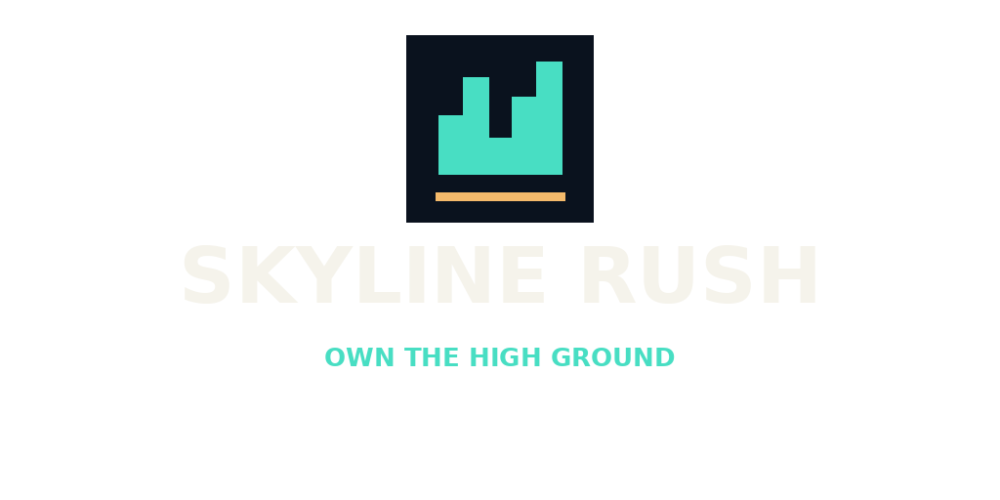

# Skyline Rush

**Own the high ground.** An independent rooftop arena shooter prototype for Jake Harvey, based on Red Eclipse.

## Playtest status

This is a development prototype, not a finished commercial release. The original and modified Linux dedicated servers build and start. Map-format, spawn-clearance and connected bot-route checks pass. Windows compilation and graphical playtesting are being verified separately.

## What is new

- Original Braamfontein Heights rooftop blockout: six roofs, crossings, cover and bot routes.
- Skyline Rush branding, logo, window icon, separate save folder and server ports.
- Rooftop Practice shortcut for five-minute bot matches.
- Independent LAN/direct-connect setup; no upstream public master registration.

## Get the Windows playtest

Open [Actions](https://github.com/jakeharvey162-source/skyline-rush/actions) and select a **successful** Skyline Rush Windows playtest run. Download its `skyline-rush-windows-playtest` artifact, extract everything and launch `skyline-rush.bat`. A successful build is not a substitute for testing gameplay on a Windows PC.

[Setup and controls](SKYLINE-START-HERE.md) · [Licensing](SKYLINE-LICENSE.md)

## Credits

Built on the work of Red Eclipse, Tesseract and Cube Engine contributors. [Original project information and contributor credits](readme.txt), [engine license](doc/license.txt) and all asset-specific licenses are preserved. Skyline Rush is an independent modification and is not endorsed by the upstream projects.
